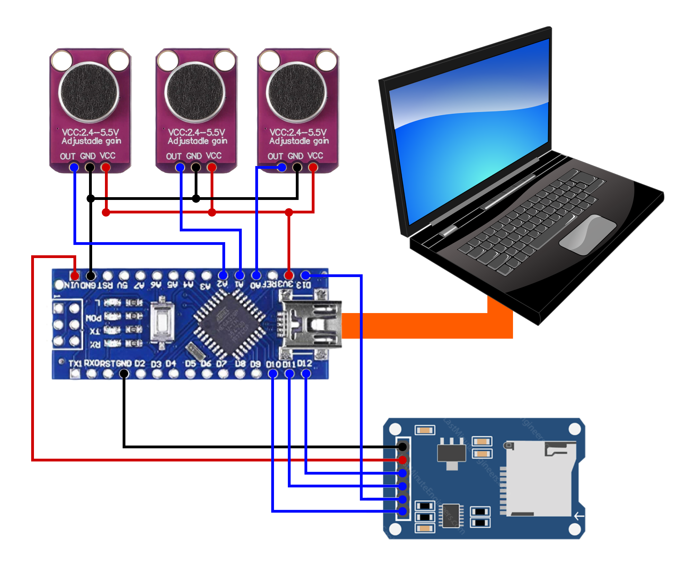

# Simple Arduino Nano Audio Recorder

## Flow:

- Computer send "RECORD" message via serial communication
- Arduino Nano record audio (analog input) data from A0, A2, A4. 2 seconds each, store to MicroSD Card
- Arduino Nano send that audio files to computer via serial communication

## Schematics

## Communication Rules

`CODE:Message`

Here is a list of all messages that possible:

1. `EVENT:Initializing SD card`
2. `ERROR:An Error has occurred while mounting SD`
3. `EVENT:SD Card Intialized!`
4. `EVENT:Cleaning MicroSD`
5. `EVENT:Recording Microphone {mic_number}`
6. `EVENT:Done Recording`
7. `EVENT:Sending Data to PC`
8. `EVENT:Sending File {filename}`
9. `ERROR:Failed Opening {filename}`

if the messages doesn't begin with `EVENT` or `ERROR`, the arduino is sending the audio files
